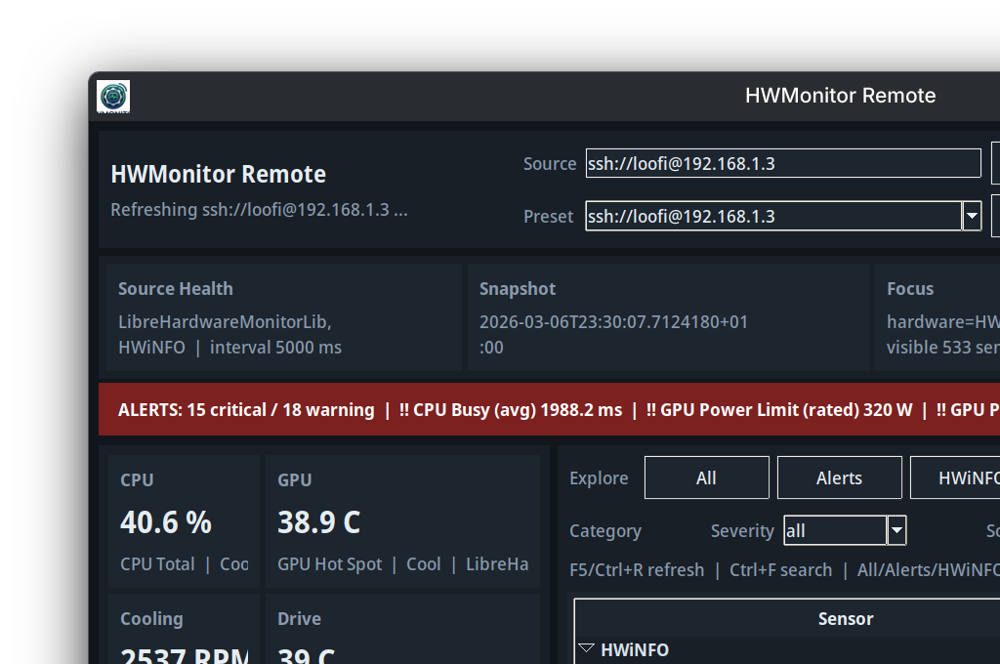
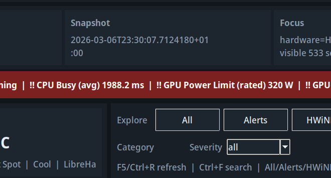

# HWMonitor Remote User Guide

This guide covers the standalone Fedora desktop app for monitoring a Windows machine over SSH or HTTP.

## Overview

The app is organized into four working areas:

1. Header: source URL, presets, refresh controls, auto-refresh, and wallboard mode.
2. Telemetry strip: source health, latest snapshot timestamp, current focus/filter state, and alert totals.
3. Dashboard rail: summary cards plus insight tabs for pinned sensors, active alerts, movers, alert log, and CPU cores.
4. Sensor explorer: quick scopes, filters, the main sensor tree, and the selection detail panel.



## Getting started

1. Launch the app with `hwremote-monitor`.
2. Keep the source set to `ssh://loofi@192.168.1.3` unless you want to point it at an HTTP exporter.
3. Click `Refresh` for an immediate snapshot or enable `Auto`.
4. Save common endpoints with `Save Preset` so you can switch hosts quickly later.

## Understanding the top of the app

The telemetry strip gives you the fast operational read:

- `Source Health`: which merged data sources are currently present, such as `LibreHardwareMonitorLib` and `HWiNFO`
- `Snapshot`: the timestamp of the most recent payload
- `Focus`: the current filters and how many sensors/groups are visible
- `Alerts`: current critical and warning totals

The red alert banner only appears when alert thresholds are breached. Use `Show` to jump into active problems.

## Browsing sensors quickly

Use the quick-scope buttons first. They are faster than rebuilding the full filter set manually:

- `All`: reset back to the full tree
- `Alerts`: show only active warning/critical sensors
- `HWiNFO`: focus on the HWiNFO subtree
- `Native`: focus on the base LibreHardwareMonitor data

Then refine with the second-row filters:

- `Category`: temperature, load, cooling, power, clock, or storage
- `Severity`: all, active, critical, or warn
- `Source`: merged source filter
- `Hardware`: limit to a specific hardware subtree
- `Compact`: hide noisy HWiNFO counters while keeping search access



## Working with the dashboard rail

The left rail is for fast triage:

- `Pinned`: your saved sensors plus smart auto-favorites
- `Alerts`: the hottest current problems
- `Movers`: sensors changing the fastest between samples
- `Alert Log`: persisted alert history with acknowledgement support
- `CPU Cores`: hottest core temperatures

The summary cards at the top prefer cleaner primary sensors and include source/severity context to reduce noisy HWiNFO duplicates.

## Using the selection panel

The selection panel stays visible even when nothing is selected, so the app never loses context.

When you select a sensor, it shows:

- current value, min/max, and severity
- session average and spread
- effective threshold state
- recent trend chart
- actions for pinning, muting, threshold overrides, and copy/focus helpers

## Alert controls

Per-sensor alert management is available from both the context menu and the detail panel:

- `Mute Alert / Unmute Alert`
- `Warn = Current`
- `Critical = Current`
- `Clear Thresholds`

Custom thresholds and mute rules are persisted in the local config file.

## Wallboard mode

Use `Wallboard` or press `F11` to switch into passive monitoring mode.

Wallboard mode:

- uses fullscreen presentation
- rotates through problem sensors automatically
- keeps alert counts and current focus visible

Press `Esc` to exit wallboard mode.

## Keyboard shortcuts

- `F5` or `Ctrl+R`: refresh now
- `Ctrl+F`: focus search
- `Ctrl+L`: focus source URL
- `Ctrl+S`: save current preset
- `P`: pin/unpin selected sensor
- `Esc`: clear filters or exit wallboard mode

## Packaging and install

Build the Fedora package locally with:

```bash
./scripts/build-rpm.sh
```

Install the newest local RPM with:

```bash
./scripts/install-rpm.sh
```

More packaging details live in `packaging/README.md`.
